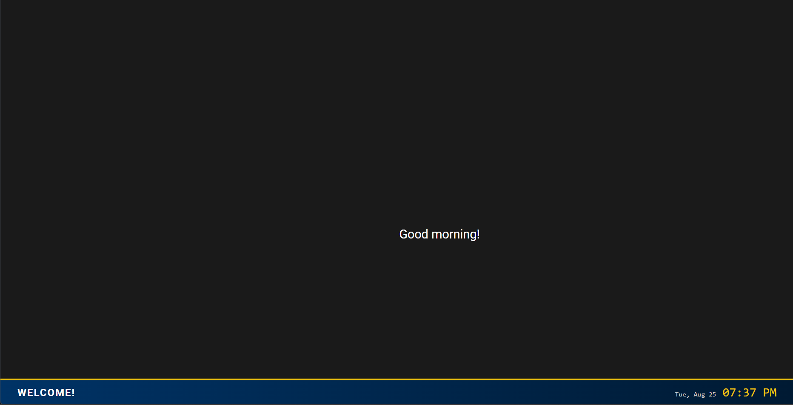
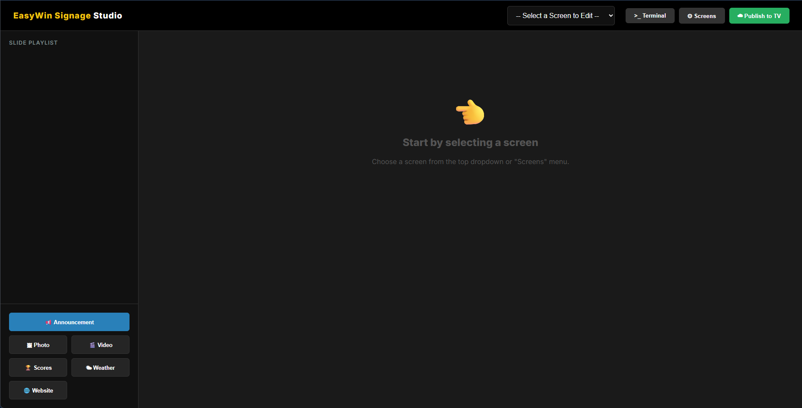

# Easy Win Signage

Easy Win Signage is a streamlined, plug-and-play digital signage system built on a compact Raspberry Pi console. Designed for absolute simplicity and versatility, every unit is capable of operating as both a **Player** (displaying content) and a **Creator** (managing and uploading content).

## 📦 What's in the Box

When you receive an Easy Win Signage system, you get everything needed for an immediate, self-contained setup:

* **Easy Win Signage Console:** A custom-enclosed Raspberry Pi that intentionally exposes only the essential ports (HDMI, USB-A, and Power) to ensure a clean, tamper-resistant installation.
* **Wireless USB Keyboard & Mouse Combo:** Plugs into the single exposed USB-A port for on-the-fly content creation and system management.
* **Power Adapter**
* **Short HDMI Cable**
* **Short Ethernet Cable**

## 🏗️ Software Architecture

The software operates as a localized web application powered by a Node.js backend, allowing it to function seamlessly on a local network.

* **Core Backend:** The system runs on Node.js (managed via `package.json`), with a `START_SERVER.bat` file available for easy server initialization.

* **Creator Interface:** Users can access `public/admin.html` and `public/dashboard.html` to upload media and schedule content directly from the unit.

* **Player Interface:** The `public/receiver.html` file acts as the primary display endpoint, pulling active content from the server.

* **Local Media Hosting:** Assets like `.png` images and `.mp4` video files are uploaded to and served directly from the `public/uploads/` directory, ensuring fast, offline-capable playback without relying on external cloud storage.

## 🚀 Quick Start Guide

1. **Connect the Hardware:** Run the short HDMI cable from the console to your display. Plug the wireless receiver for your keyboard and mouse into the USB-A port.
2. **Provide Network Access:** Connect the short Ethernet cable to your local network router or switch.
3. **Power Up:** Plug in the power adapter. The console will boot directly into a dedicated kiosk environment.
4. **Create & Broadcast:** Use the provided wireless keyboard and mouse to access the dashboard, upload your images or videos, and launch the receiver view to start displaying your signage.

(c) 2026 Olly Davis
